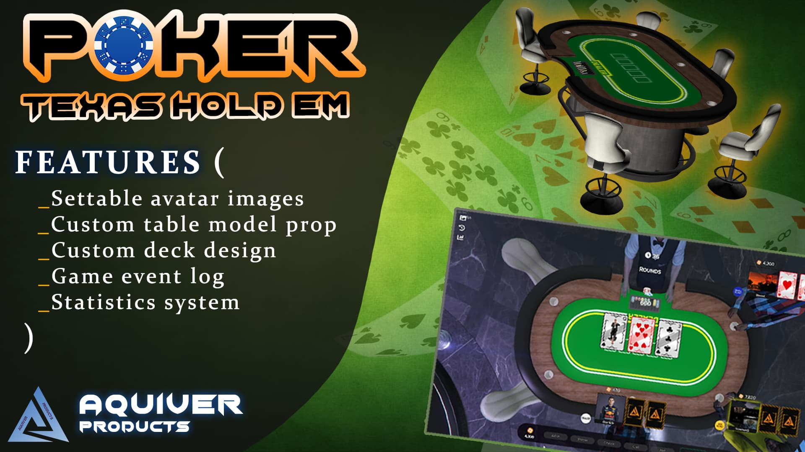

# About

Basic things to know about the Texas Holdem Poker.

## Basic
:::caution
The script is written in Typescript, so you will have to compile the server and clientside in order to make the script start.
:::

## Links
- [Forum post](https://forum.cfx.re/t/paid-standalone-texas-holdem-poker/4777897)
- [Showcase video](https://youtu.be/6_8SUaYkpm0)

## Features
- [x] Custom deck design, with all of the 52 cards.
- [x] Custom table model prop.
- [x] Easily creatable tables with adjustable blinds. (We are spawning the models)
- [x] Player sit animations are synced, unless you have oneSync turned on. (This will mess up the syncing sometimes)
- [x] Statistics system, it will save: amount of chips betted(all),played games, calculate the winrate and other things.
- [x] Openable statistics on players, who are playing.
- [x] Game event log
- [x] Settable avatar images.
- [x] Responsive design. (Vue, not webpacked)
- [x] Players are able to watch the game without sit down at the table, if five players playing the game, and thats a community event then the whole server can watch the poker game hows it playing out. (Simply pressing E)