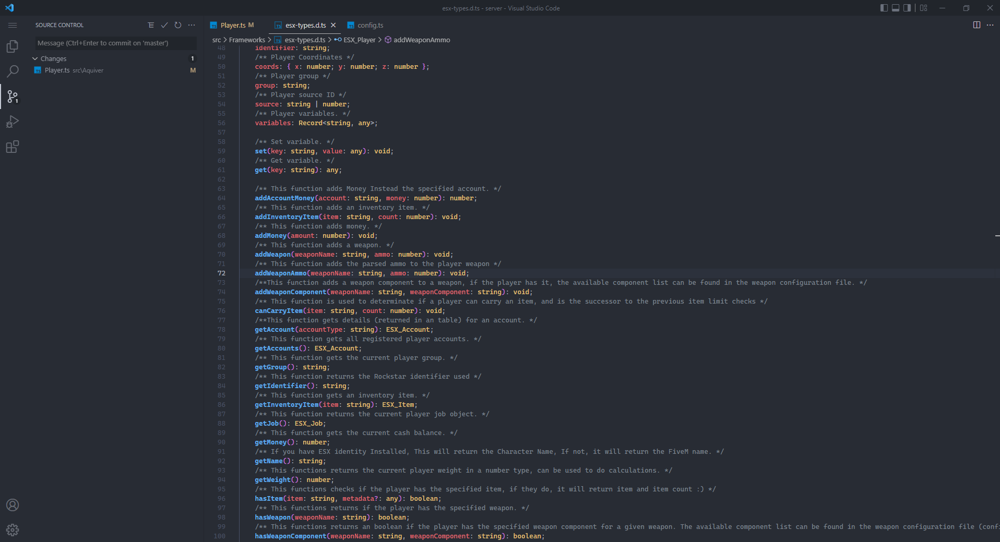
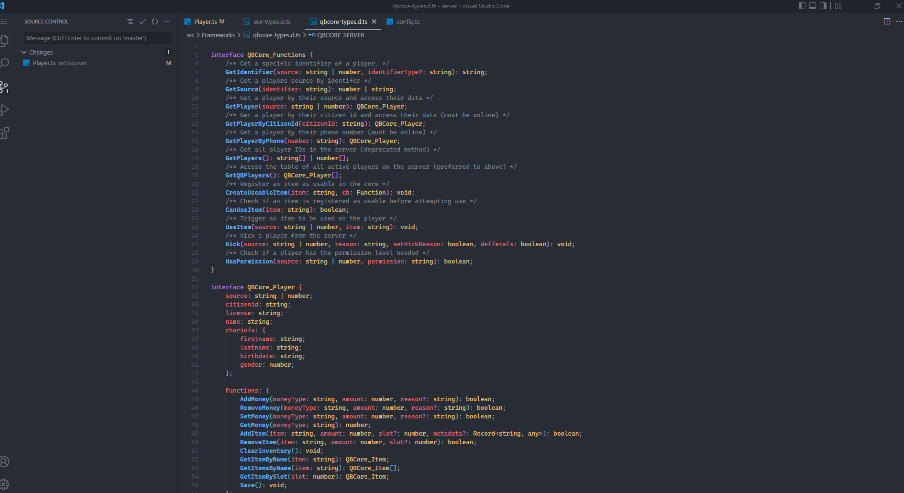

# 💻 Developing

## Type definitions.
:::info
Some are still missing, but the ones we needed are there.
:::



## Extending Player class to access all methods
You will be able to trigger every class functions which implemented in the **Aquiver.ServerPlayer** class.
```typescript title="Typescript example"
class MyPlayer extends Aquiver.ServerPlayer {
    constructor(source: number | string) {
        super(source);

        this.addItem("bread", 1, {
            QBCore: {
                slot: 2,
                metadata: {
                    yeeey: true
                }
            }
        });
    }
}
```
```typescript title="Framework specified addItem (version 1.5) maybe its different in the newer versions."
/**
 * This function adds an item.
 * @param item
 * @param amount
 * @param extra You can add additional framework specified arguments.
 */
addItem(
    item: string,
    amount: number,
    extra?: {
        QBCore?: { slot?: number; metadata?: Record<string, any> };
    }
) {
    switch (Config.Framework) {
        case 'ESX_LEGACY': {
            const Player = Frameworks.ESX.GetPlayerFromId(this.source);
            Player.addInventoryItem(item, amount);
            break;
        }
        case 'QBCORE': {
            const Player = Frameworks.QBCore.Functions.GetPlayer(this.source);
            Player.Functions.AddItem(item, amount, extra?.QBCore?.slot, extra?.QBCore?.metadata);
            break;
        }
        case 'CUSTOM': {
            globalThis.exports[GetCurrentResourceName()].addItem(this.source, item, amount);
            break;
        }
    }
}
```