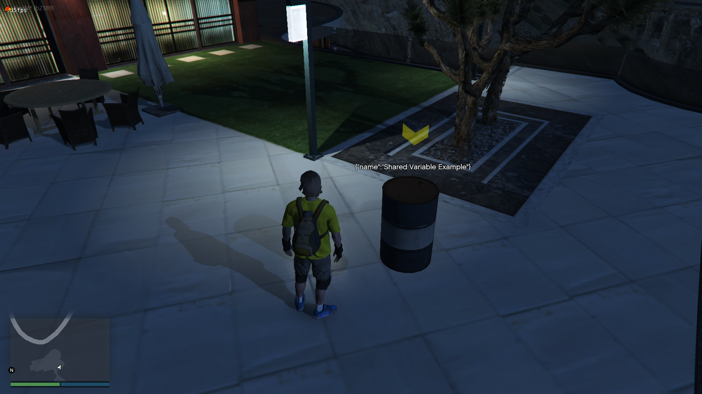

# About

Basic things to know about the Serverside Object Controller.

## Basic
Serverside 'static' object creator for FiveM.

You can easily create objects on serverstart with synced variables and other helping functions.

:::danger
Keep in mind these objects are not networked on clientside, so if you are triggering a clientside function on them it will not be synced to other clients.
:::

## Links
- [Download](https://github.com/freamee/Serverside-ObjectController)
- [Forum post](https://forum.cfx.re/t/serverside-object-creator-controller/4799024)
- [Showcase video](https://youtu.be/CDF3J4obR_0)

## Features
- [x] Add variables to objects (shared or only server variable)
- [x] Click on objects with raycasting. (turnoff available in config.lua)
- [x] Config and 'globally' triggered events already added. (Object clicking, variable change, etc.) GO TO CONFIG
- [x] Easy & reactive functions. (position, etc.)

## The use of this resource
If you are planning to make a job/hobby where you need to create static objects and set variables on them then this resource will make your life easier.

**Example idea:** 
> You want to create a wine job with spawned barrel objects.
In some way you will want the player to have action with the barrels, for example lets assume that the player have apples in his inventory, he can put these apples inside the barrel, so when the object clicked you open some kind of menu then the actions will be showed, the player puts in the apples inside the barrel, you easily set the variables on serverside.

> Now this barrel have a globally set safe variable on serverside.