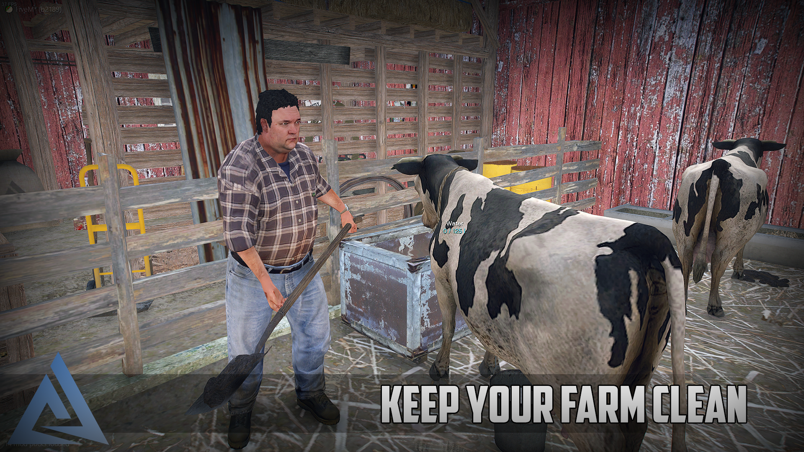
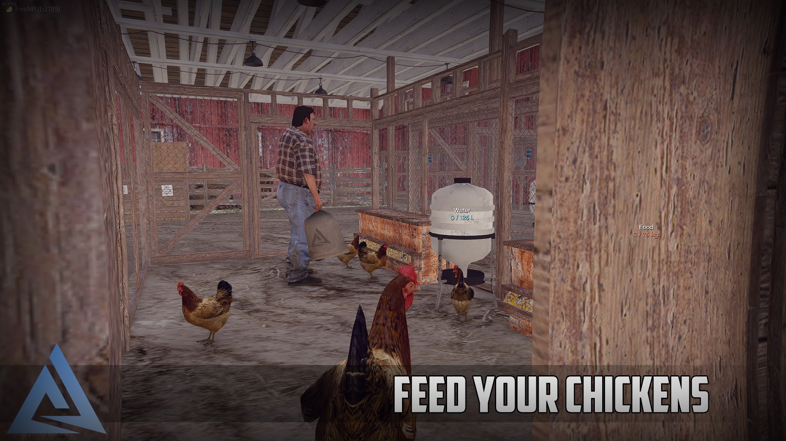
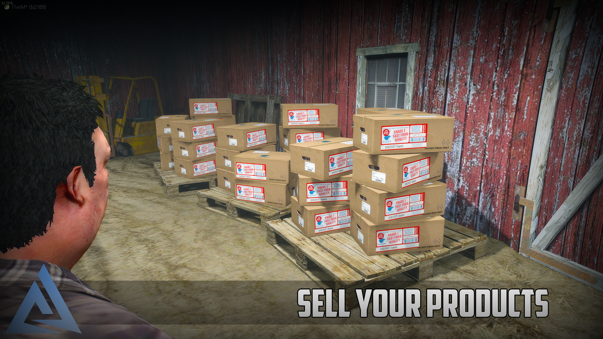

# About

Basic things to know about the Animalfarm.

## Basic
:::caution
The script is written in Typescript, so you will have to compile the server and clientside in order to make the script start.
:::
:::danger
We tried to balance the script with our calculations, but every server has a different economy system, if you do not want to calculate everything through, we made a variable for you which changes globally the prices for everything.
:::

## Supported frameworks
[See Aquiver module](../../aquiver_module/about.md)

## Links
- [Forum post](https://forum.cfx.re/t/sale-paid-standalone-aquiver-animal-farm-system/4839027)
- [Showcase video](https://youtu.be/j-tisQ5dbZE)

## Subscription vs lifetime
This resource is not about simplicity, we can not guarantee that your server will run this script with +200 players without lag. (We could not test it with that many players.)

### Why choose subscription ?
So you can try the script, test it out with your friends and see if it runs well on your server.

## Features
:::info
We have made a custom modelled interior shell for the Animal Farm which is basically a Barn, so the interior is always in one fixed position, so i had to make a custom dimensional system which handles the object and every other entities.
:::
:::info
Comes from the Dimension system, you can create as many farms as you want, it will eat up more memory and usage on the serverside, but on the clientside, the farm objects and other necessary things only loading when you enter the farm, so the script idling is around 0.02-0.04ms.
:::
:::info
If you are inside the farm it will cost more performance, because everything is in a 'small' modelled interior, and need to render many things, but the render tickers are editable if you want to reduce the CPU usage, but i do not recommend it. We had around 170-180 fps inside the interior.
:::

- [x] Custom dimensional manager for Objects / Players / Particles / Peds, etc.
- [x] Custom attachment handler.
- [x] Raycast on objects / peds.
- [x] Upgrading system
- [x] Animal buying
- [x] Available animals:
- [x] Chicken (generating Egg [passively])
- [x] Cow (Milk [gather])
- [x] Pig (Meal [gather])
- [x] Every math is configable if you want to mess with the numbers.
- [x] Our modelled/edited props:
- [x] Animal Farm base shell (Barn)
- [x] Chicken paddock
- [x] Basic paddock
- [x] Composter
- [x] Chicken feeder
- [x] Chicken drinker
- [x] Rabbit cages
- [x] Bucket with states (Milk, Water, Empty)
- [x] And other props modified. (Shovel made for hand, etc.)

## Images

