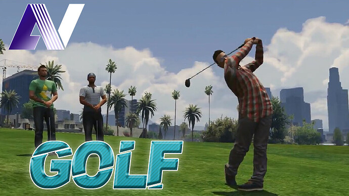

# About

Basic things to know about the Golf.

## Basic

:::caution
This resource is standalone, so it is not linked to any framework, comes from that you will need to adjust some functions to fit your server, explanations below.
:::

## Links
- [Forum post](https://forum.cfx.re/t/sale-standalone-paid-aquiver-golf/3885774)
- [Showcase video](https://youtu.be/Nd8MOD8UWL0)

## Features
- [x] Four ball types (White, Yellow, Green, Pink)
- [x] Distance calculator (compared to the selected flag, and the current hitted distance)
- [x] Leaderboard system with MySQL save, which records the longest hit from the player.
- [x] Different material forces with sound & particle effects.
- [x] Terraingrid (if you want to check slopes or uphills)
- [x] Few camera setups (for checking the selected flag, etc.)
- [x] Wind direction and Wind speed modify the ball movement. (Default is disabled, with the wind i could not hit a thing. :smiley: )
There is also a marker which shows the current Wind movement and strength. (The marker color changes how strong the wind is, i used heatmap, so strong wind is red, and how the wind reduces it goes bluer.)

## Things you can modify in the config.lua
- [x] Enable/Disable the wind force. (makes ball move differently)
- [x] Enable/Disable the tree leave hits. (it stops the ball movement)
- [x] Club strengths. (Though, i do not recommend modify the default values)
- [x] Ground slowing speed
- [x] Player rotate speeds
- [x] Keybinds (scaleform button ones, because they are reactive for the changes)
- [x] Leaderboard enable/disable & command, and how many players shown on the board. (Default 10)
- [x] You can enable/disable the need of the default gta weapon_club if you want, it wont stuck your script, but because we are using attached clubs when aiming with the ball, the script removes the weapon from the hand when you are interacting. (Default is disabled)