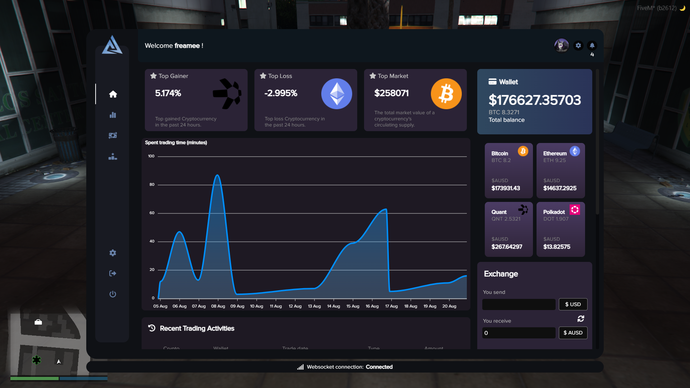
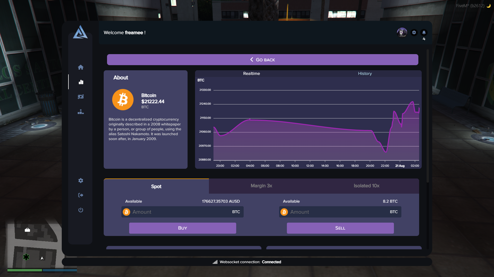
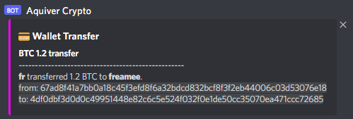
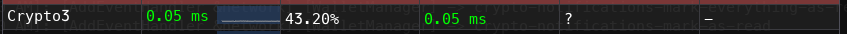

# About

Basic things to know about the Advanced Crypto market resource.

## Basic
:::caution
The script is written in Typescript, so you will have to compile the server and clientside in order to make the script start.
:::

:::info
This resource is using [Aquiver module](../../aquiver_module/about.md), so the resource is working with the compatible frameworks.
:::

## Links
<!-- - [Forum post]()
- [Showcase video]() -->

## Features
- [x] Register & Login into any wallet.
- [x] Almost everything is settable through config.
- [x] Premium user badge what the server owner can give to players.
- Being a premium user you will have a custom badge, and lower fees will be applied during payments.
- [x] Discord API (Through webhook) [Can be turned off]

- [x] Leaderboard [Can be turned off]
- [x] Reactive NUI, everything syncing realtime. (If more user is logged into the wallet and any change has been made.)
- [x] Real Cryptocurrency prices through Binance API & Websocket.
- [x] Websocket is running clientside only, when the panel is opened. (We tried it on server, but it caused so much flood.)
- [x] Saving Cryptocurrency prices with a settable interval through config, this values will be shown in the history chart.
- [x] Saved recent trades & payments
- [x] Flood protection to block serverside from NUI flood when fetching data.
- [x] Many other (watch video), feel free to ask anything.

## Read! Important!
This resource will surely eat up more memory than the other resources. You can increase the performance by reducing the mysql table maximum rows (through our settable config), and increase interval times.

If you are playing on ultra graphics and everything is maxed out, maybe the NUI will react slower due to the running Websocket.

## Performance
We tried increasing the serverside performance by calculating almost everything on the clientside.

But due to the node_modules and .js and the many data store in serverside, we achieved this performance.

This will surely changes when more players have the NUI opened, and data fetching happens, but that is how it is.

**Serverside performance**

**Clientside performance**
- No clientside code, everything is handled in the NUI.