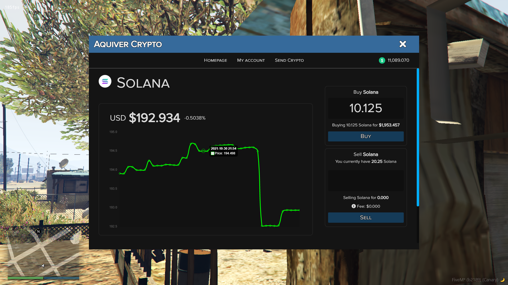
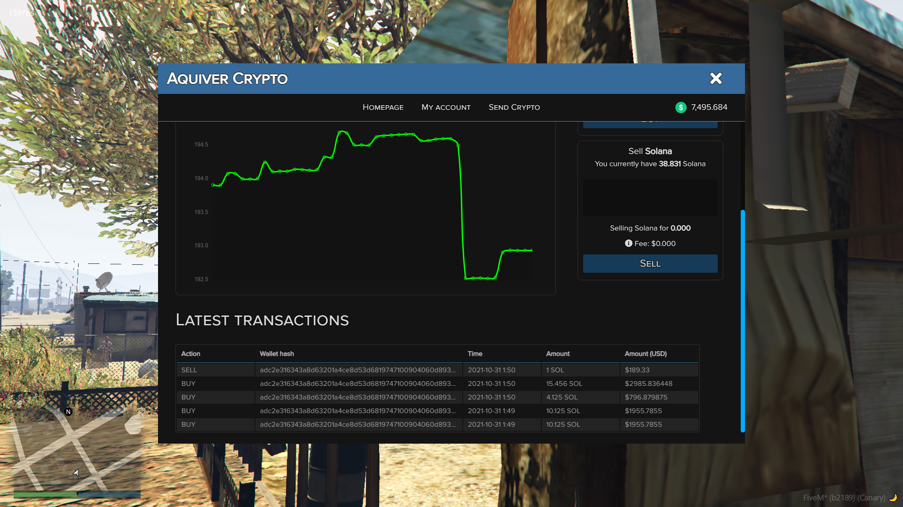
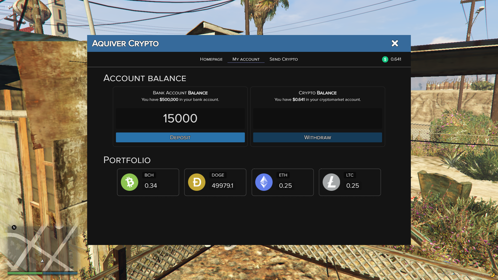
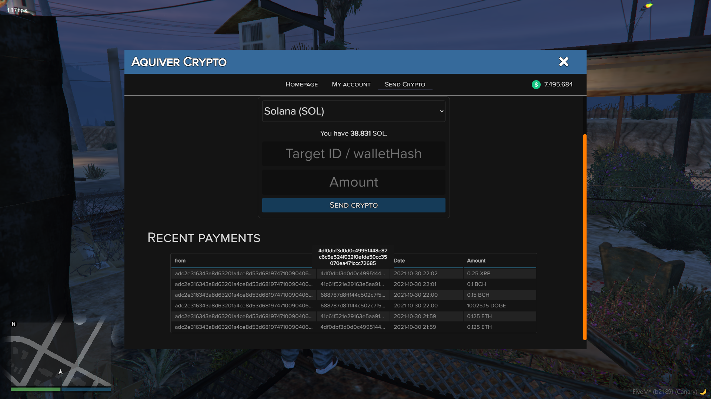
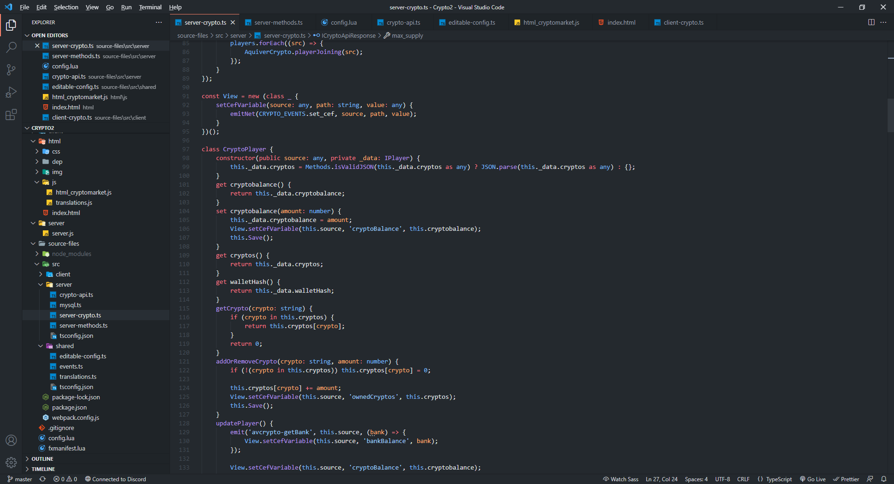

# About

Basic things to know about the Crypto resource.

## Basic
:::caution
This resource is standalone, so it is not linked to any framework, comes from that you will need to adjust some functions to fit your server, explanations below.
:::

:::danger
The whole resource uses an API to work.
If the API server is down then the resource will not work !
:::

## Links
- [Forum post](https://forum.cfx.re/t/sale-standalone-paid-cryptomarket-2-0-fixed/4775333)
- [Showcase video](https://youtu.be/CDF3J4obR_0)

## Features
- [x] 'Real' crypto currency prices, we are using crypting-up api.
- [x] Wallet hash generated for the players, players can send crypto to online players with targetId, or offline with the target's wallet hash.
- [x] Payments history, outgoing-incoming.
- [x] Crypto transactions history, when someone buys/sells a crypto it is showed to everyone with his wallet hash.
- [x] Crypto price history chart, we are 'manually' saving the prices when the update happens, we could not find a free crypto-history api, so we implemented our 'system'. This means, if your server is not running, then it does not saves that days history.
- [x] There is a custom 'cryptobalance' linked to your wallet, we needed this because we are using 3 decimals for the prices, and we did not wanted to mess with your server bank system, so you will need to top up your crypto account's balance to buy cryptos.
- [x] Crypto prices are also using 3 decimals.
- [x] Easily addable cryptocurrencys.

## Mentionable changelogs
### 2.0
- The code now is written in Typescript, not Javascript.
- Using crypting-up api for the prices, which is updating more frequently.
- I raised the 60000 update interval to five minutes, we can not just flood a free crypto api a millions of times per day.
- Sometimes the NUI did not update with the serverside events.
- Lodash set html, so we basically have one event to modify the NUI frontend.
- And many other small things, which do not worth mentioning.
### 3.0
- mysql dependency updated to mysql2 (more updated, less errors)
- Entire crypto got rewrited, now it is more stable.
- Marketcaps now only querying the mysql when the server stars.
- Marketcaps now update realtime when you buy/sell any crypto.
- Export functions has changed a bit, only removeBank/addBank got removed instead we use setBank.
- Notification event changed to export function, and it is handled by one function under the Player class (Player.Notification)
- Shitty formatting in the html got deleted, it always messed up my thinking (the dots, etc.)
- Now you can not sell/buy crypto if the dollar value is less then < 1$. (It did not break anything, but there is no point for this low amount of.)
- NUI (sendCrypto) walletHash did not update when the inserted a non exist target id.
- Some decimal fixes were also made, so it will not give you a huge number 0.0000111111 etc.
- Another export functions are added, if someone wants to add functions to another resource (lua)
- config.lua only loads serverside now.
- and other backend things.