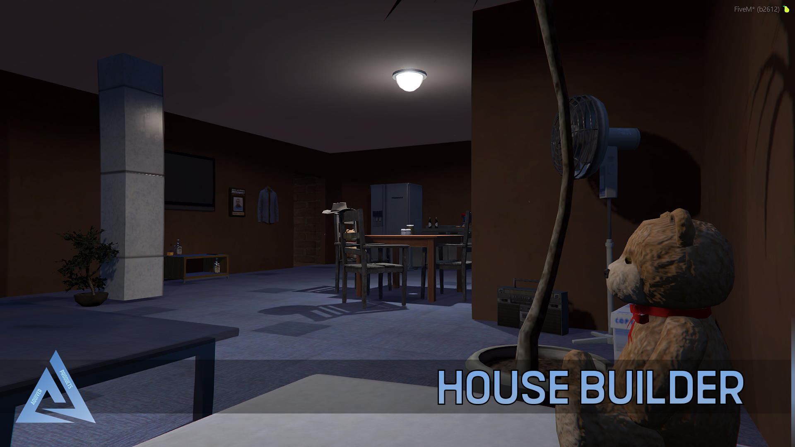
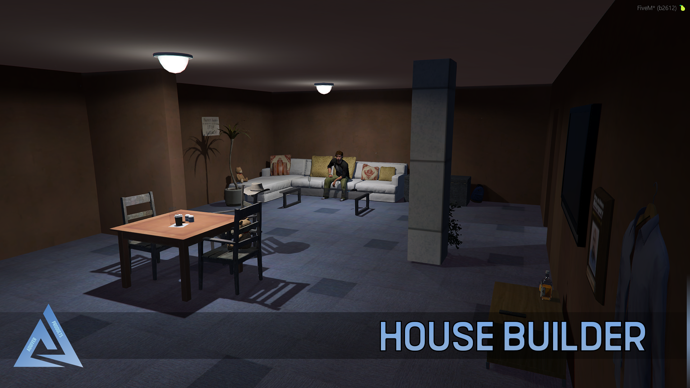
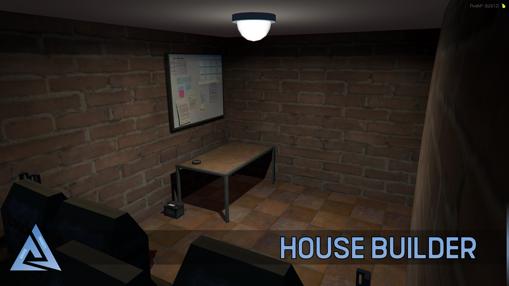

# About

Basic things to know about the Aquiver Housing resource.

## Basic
:::caution
The script is written in Typescript, so you will have to compile the server and clientside in order to make the script start.
:::

:::info
This resource is using [Aquiver module](../../aquiver_module/about.md), so the resource is working with the compatible frameworks.
:::

## Links
- [Forum post](https://forum.cfx.re/t/sale-standalone-paid-cryptomarket-2-0-fixed/4775333)
- [Showcase video](https://youtu.be/CDF3J4obR_0)

## Features
- [x] Creating and deleting houses ingame with NUI panel.
- [x] Dimension system for entities such as objects, etc.
- [x] Works with custom MLO interiors. (easy to add)
- [x] Furnituring system. (with .png images in NUI)
- [x] House building sytem (walls, floors, etc.) for more explanation please watch the video.
- [x] Objects are spawned serverside, you can add a checker there and load your inventory stashes from there. (objects have unique mysql ids)
- [x] +700 objects (with images), you can add additional.
- [x] Share keys with others to build house together.
- [x] Locking / Unlock
- [x] Locale files
- [x] etc.