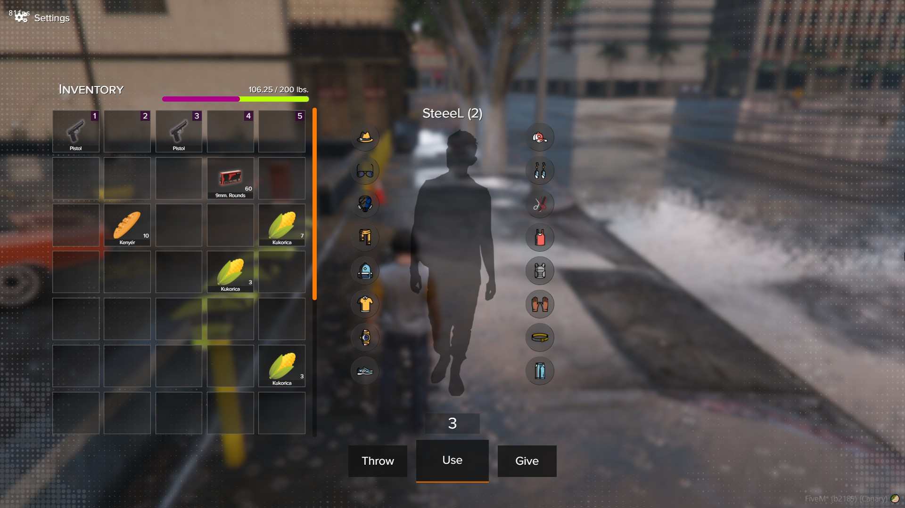
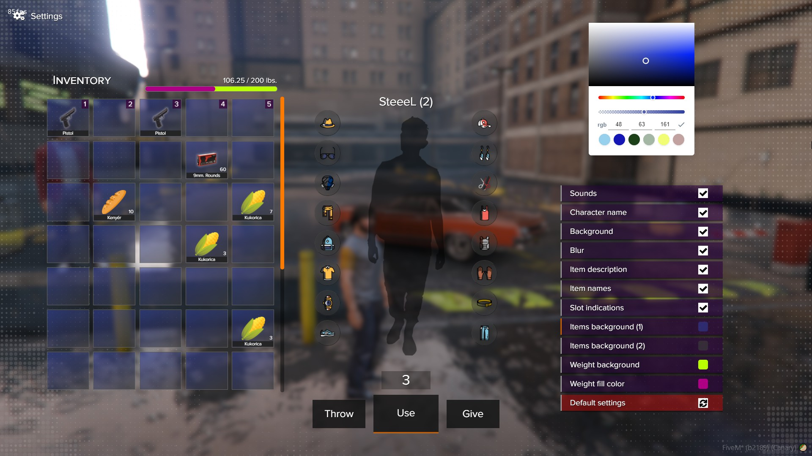
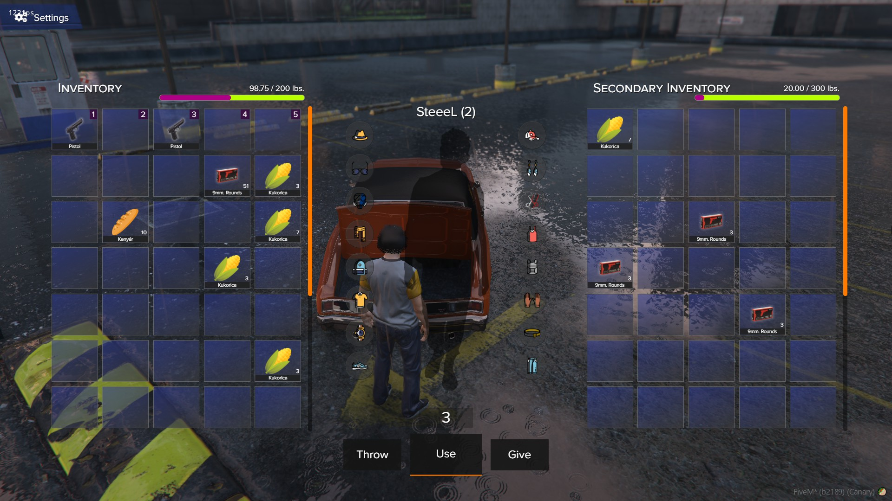

# About

Basic things to know about the Inventory 2.0

## Important !READ FIRST!
:::danger
This resource is standalone, so it is not linked to any framework, comes from that you will need to adjust a few things to run smoothly, eg. faction system and others.

You need to have a custom shop system to buy items, because the shop will not open in the 'secondary' inventory like with the most of the FiveM inventory systems.

If you are not familiar with basic lua scripting, eg. how tables work etc, i do not recommend to buy this resource, inventory systems can become really complicated if you are a beginner. I can not reply in an hour for you if you are stuck with something, best you can do is to request help in our Discord server at the right channel. (Not in private message please, so if anyone has the same question, then it can be searched on our Discord)
:::

## Support
:::danger
We can not guarantee support with this resource, there is so many requests for inventory systems, we would have +100 messages about setup how to setup properly.
This resource is not just put the folder in and good to go.

I do not recommend buying this script, if you are not familiar with basic LUA or your server resources.
You need couple of things to know, how your server faction works and others.

**If you run into any errors we can always refund the script.**
:::

## Links
- [Forum post](https://forum.cfx.re/t/sale-paid-standalone-aquiver-inventory-system/4756762)
- [Showcase video](https://youtu.be/ycfdz1Q91w4)

## Features
- [x] Customizable frontend styling, colors and many other.
- [x] Drag and drop & move between slots.
- [x] Item 'movings' are synced between the opened players. (Important with faction safes and trunks, etc.)
- [x] Item definer constructor(Useitem, description, etc.)
- [x] Action slots (1-5)
- [x] Dropping items on the floor, with defined model. (defined it in the itemdefiner)
- [x] Item notification system, when you pickup or use item with action slot. (1-5)
- [x] Fast item interaction, when you hold shift and left click on the item, it is instantly put on the secondary or your main inventory.
- [x] The little clothing icons, let your character dress up&down. Basically its a dpclothing implemented.
- [x] Vehicle trunk opening with animation, and with boneindex. (if the vehicle has the boot bone)
- [x] Customizable weight system. (Factionsafes, Players, etc. and differently on each vehicle)
- [x] Stacking system. (You just need to set a variable, then everything will be recognized, so you will not have double weapons)
- [x] You can add starting items, when the player joins the server. (in config.lua file with custom amount, etc.)
- [x] Locale files both Lua and JS (need for the html). (currently, english and hungarian language)
- [x] Custom weapon system. We use bullets, not weapon mags. (Attachments not supported, but you can make it afterwards)
- [x] Not a MySQL eater. We only have 3-4 mysql calls. We load the player inventories when the player joins. The vehicle trunks loading on the first open, etc. And we save the inventories with a timeouter. (editable frequency in the config file)
Unique variables on items. (many as you want, you can make the attachments system with it, etc.) Example