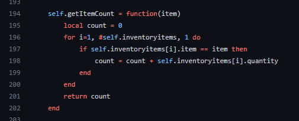

# Adding / Removing items, etc.

How to add or remove items or get player inventories?

:::info
We did not created export function(s) for you, but we have our event examples, how the adding / removing should work out.
:::

## Inventory class functions
You can find every function linked to the inventory class inside the **sv_main.lua** file. <br/>
From there, you can easily make any export function which you need.

Example, we have this function under the class.<br/>
<br/>
```lua title="Create an export function for it"
exports('getItemCount', function(source, item)
    local identifier = Config.getIdentifier(source)
    local Inventory = AquiverInventories[identifier]

    if Inventory then
        return Inventory.getItemCount(item)
    end
end)
```


## Adding / Removing
```lua title="Events"
RegisterNetEvent('AquiverInventory:Player:addItem')
RegisterNetEvent('AquiverInventory:Player:removeItem')

AddEventHandler('AquiverInventory:Player:addItem', function(item, count, vars, cb) -- this is not callback, simple event to give item to player.
    local source = source
    local identifier = Config.getIdentifier(source)
    if AquiverInventories[identifier] then
        AquiverInventories[identifier].addItem(item, count, vars, function(response)
            if cb then cb(response) end
        end)
    end
end)

AddEventHandler('AquiverInventory:Player:removeItem', function(item, count, cb) -- this is not callback, simple event to remove item from player
    local source = source
    local identifier = Config.getIdentifier(source)
    if AquiverInventories[identifier] then
        AquiverInventories[identifier].removeItem(item, count, function(response)
            if cb then cb(response) end
        end)
    end
end)
```
### Export functions, instead of events.
```lua title="Adding item, export function example"
exports('addItemPlayer', function(source, item, count, vars, cb)
    local identifier = Config.getIdentifier(source)
    local Inventory = AquiverInventories[identifier]

    if Inventory then
        Inventory.addItem(item, count, vars, function(response)
            if cb then cb(response) end
        end)
    end
end)
````