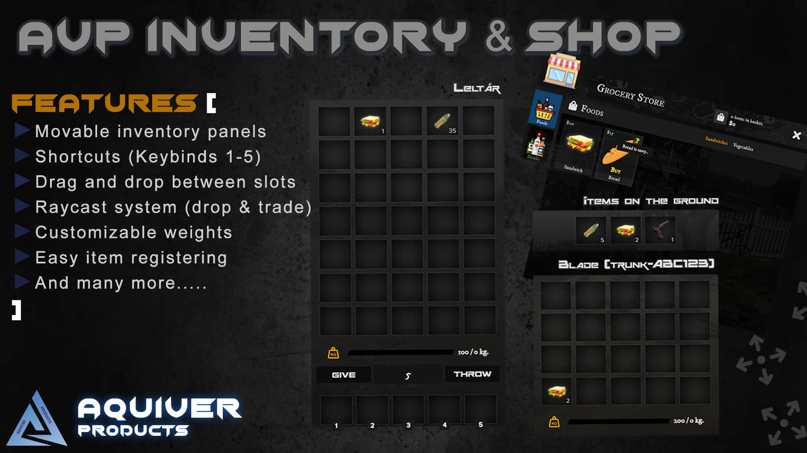

# About

Basic things to know about the Inventory 3.0

## Important !READ FIRST!
:::danger
**This is not a download & go resource. You have to modify many things in order to work properly!**

This resource is standalone, this is not linked to any framework so you will have to adjust some things to work properly with your server.
:::

## Support
:::danger
We can not guarantee support with this resource, there is so many requests for inventory systems, we would have +100 messages about setup how to setup properly.
This resource is not just put the folder in and good to go.

I do not recommend buying this script, if you are not familiar with basic LUA or your server resources.
You need couple of things to know, how your server faction works and others.

**If you run into any errors we can always refund the script.**
:::

## Links
- [Forum post](https://forum.cfx.re/t/sale-standalone-paid-aquiver-inventory-system-with-shops/4804410)
- [Showcase video](https://youtu.be/0S9Arw60l2U)

## Features
- [x] Vehicle trunks gloveboxes & faction safes.
- [x] Drag and drop between slots.
- [x] Shortcuts (Keybinds 1-5)
- [x] Moving items inside inventories are synced between the opened players. (Neccessary with trunks and others)
- [x] Dropping items on the floor. (With custom raycasting system)
- [x] Customizable vehicle trunk & glovebox weights.
- [x] Easy item define and registering usable items.
- [x] Weapon system (You can set different bullets for different weapons, you do not need to use bullet mags no more. Bullets are realtime updates clientside with the amount.)
- [x] and many more… (Explained later in the functions.)