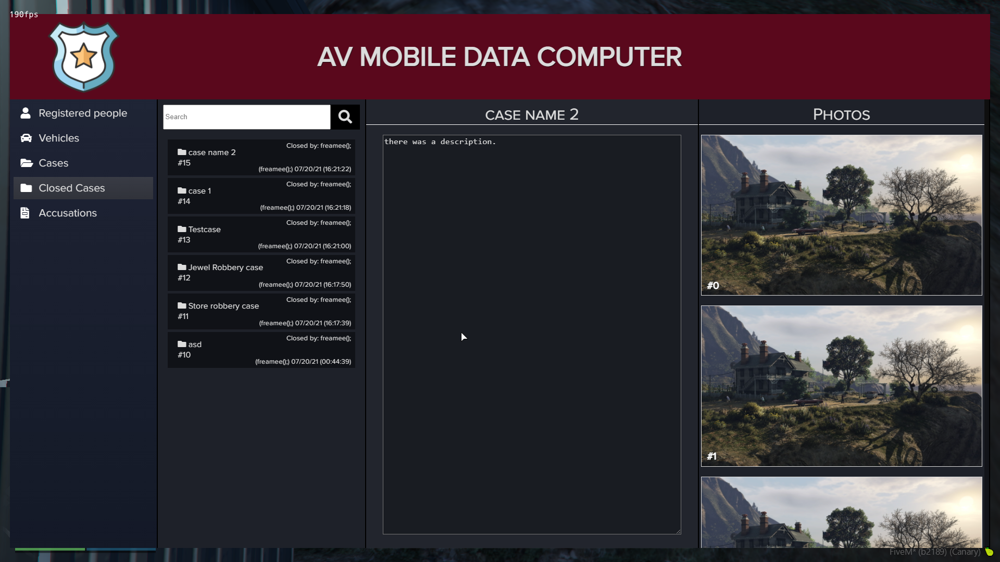
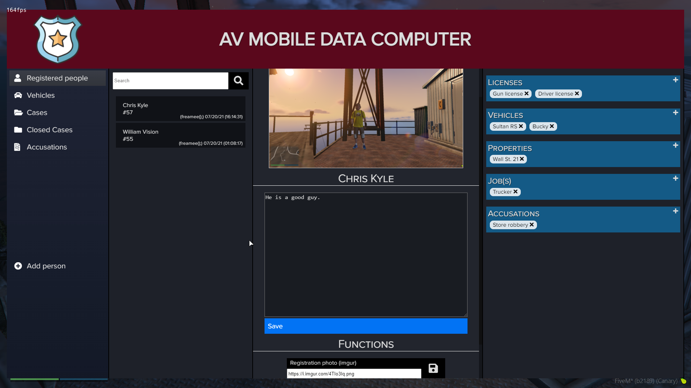
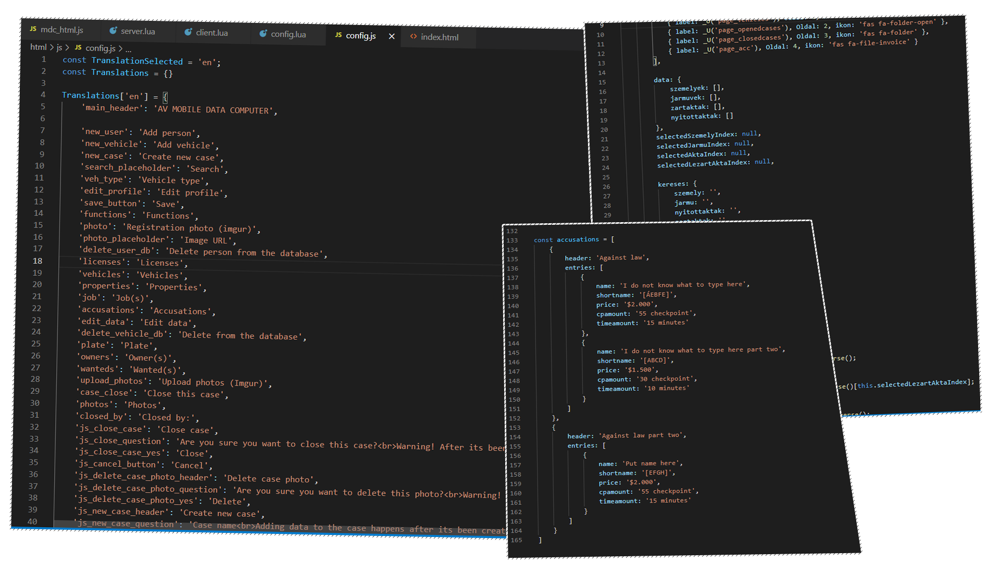

# About

Basic things to know about the Mobile Data Computer.

## Basic

:::caution
This resource is standalone, so it is not linked to any framework, comes from that you will need to adjust some functions to fit your server, explanations below.
:::

:::danger
You need to set it up with your faction system in the config.lua file.

Currently you are opening the mdc panel with a command, which is editable in the config also, but i recommend it to add to any of your menu panels for easier access for police players.
This script is full standalone, so we do not have any information about your server, comes from that there is no automatic result data for the MDC. (Like getting telephone numbers, etc.) 

Every information is gathered by the police players. (We have it on our server like this, we do not like that when the player just enters the name, and a whole database comes up with player informations from nowhere... [MG])
:::

## Links
- [Forum post](https://forum.cfx.re/t/sale-paid-standalone-aquiver-mobile-data-computer/4741671)
- [Showcase video](https://www.youtube.com/watch?v=T_AdilmI4I8)

## Features
- [x] Synced between opened players (refreshing instantly when modified)
- [x] Locale files in HTML, so you do not need to mess with the full html thing, you just need to rewrite the variables for your nationality.
- [x] Not exploitable with post requests, everything is checked on serverside, so if the player is not allowed for the event, he will not get the result.
- [x] Create & Close cases, add photos to them via image urls.
- [x] Register & delete people and vehicles, add their description and every informations related to them.
- [x] Accusations page, which you can edit in the config.js file (if you want to keep yours ingame, not on Discord, etc.)
- [x] You can set who has the permission to close the cases and also delete the registered people and vehicles. (Set it up in the config.lua, for you faction system leader)
- [x] Currently we used our steam names [as you see freamee();], but you can edit this in the config.lua if you want to set roleplay names. (Config.PlayerName) It is automatically setup if you have ESX or any other framework.